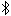

The Shetland Attack Pony 6 (SAP6) Cave Surveying Device
=======================================================

.. toctree::
   :maxdepth: 2
   :caption: Contents:

Basic Use
-----------

* SAP6 is operated by 2 buttons, **A** (nearer the laser) and **B**

* Turn ON to take readings (this is ``measure`` mode): Press **A** twice in quick succession

* Turn OFF: Press **A** twice in quick succession

* Switch/toggle between ``menu`` and ``measure`` modes: Hold down **B**

* Select a menu item: Press **A**

* Move to next menu item: Press **B**

* Return to main menu: cycle though menu items to ``BACK`` option

* You can always double click **A** to turn OFF and then start again (eg if you unintentionally go into calibration
  mode)

* To charge the SAP6, unscrew the blue end cap and use a USB C cable. It takes approx 2 hours for a full charge. Do not
  charge the device from a powerbank whilst taking readings as this may cause interference with the magnetic readings

* You can use the USB C cable to access files on the SAP6 and to update software for the SAP6 (details below)

Measure Mode (to take readings)
-------------------------------

Press **A** to take a reading. You will get an error if the device is not already :ref:`calibrated <Sensors>`.
You can choose either a short press of **A** (the reading is taken just after the button is released) or a long press
of **A** (the reading is taken after about a second, or can trigger a countdown timer which can be configured).
Play with each mode and see what suits you.

If the reading is successful you will see three numbers on the screen: 
.. compass at the top (degrees or grad)
.. inclination (+ or - and degrees or grad) 
.. distance (m or feet) at the bottom 

If the reading fails you will hear an error double beep and see an error message. This will either say "Laser read
failed" or "Magnetic Anomaly: Iron near".

The laser stays on in ``measure`` mode. This does not require much power

Press **B** to cycle through previous readings. You can tell which reading you are looking at by the small number at
the right side of the display.

.. |bt_on| image:: bt_on.png

If three successive readings are within tolerance they are interpreted as a leg rather than a splay and the device will
give a success beep (rising) and flash the laser twice. Within tolerance means that, for each of the three pairwise
comparisons between the three readings, the angular difference is less than 1.7 degrees and the change in distance is
less than 5cm.

There is a bluetooth indicator on the top right of the screen:
|bt_on| if connected, |bt_off| if not. If you lose the bluetooth connection, the device will store up to 20 readings in
the RAM memory. Readings are sent automatically when the bluetooth connection is restored.

Readings can be saved to the flash drive to provide a backup. A reading taken > 8 hours since the previous reading will
be stored in a separate trip file.

There is a battery level indicator on the bottom right of the screen. If you want to save power, turn off the device
between stations.

When you hold **A** to take a reading, the SAP6 will trigger a timer. The timer mode can be configured to a 0, 3, 5,
or 10 second countdown. For settings greater than 0, the unit will beep every second until it takes the reading.
If set to 0, it will take the reading after about a second while the button is still held (this is the normal
behavior in firmware versions 1.0.2 and prior).

Battery Life
------------

Test results in ideal circumstances (room temperature, about 4m range to a white wall, 10 seconds between successive
readings, display on):

* ~4500 readings taken
* 14 hours run time

There are some factors that affect battery consumption:

* Temperature - poorer capacity with colder temperatures
* Range  - increased battery usage with longer legs
* Cave colouration:  increased battery usage with darker targets

Menu Mode (to change settings)
------------------------------

To navigate through the menu, press **A** to select an item and **B** to move on to the next item. Return to the main
menu by cycling though menu items to the``BACK`` option

You can directly turn on in ``menu`` mode by pressing **A** twice while holding down **B**

The menu options are:

Calibration
+++++++++++

Sensors
*******

You need to calibrate the sensors the first time you use the SAP6, and then again any time that you move to a location
with a substantially different magnetic field strength or dip. The SAP6 will only save one calibration setting (in the
config.json file) so if you recalibrate these values will be overwritten (though you can download and save your
``config.json`` file and reload it later).

Once you enter the calibration routine you will ideally take 24 readings. Press **A** to take each reading, and press
**B** when all 24 are taken. You can cancel the calibration at any point by double-clicking **A**.

The recommended calibration routine (details below) starts with 8 readings taken in random, but well spread out,
directions and then 8 accurate readings between two points, rotating the device by 45° along its long axis between each
shot, then another, similar set of 8 accurate readings ideally taken at about 90° from the first set.

Don't worry if you don't get these readings exactly right (eg if you take one reading twice over), the algorithm will
identify which readings are in the same direction and adapt accordingly. The algorithm will also allow you to take more
than 24 readings before calculating the calibration

An example of a good calibration protocol would be to: 

* find a location well away from chunks of iron - perhaps in a wood or a cave

* for readings 1-4, put the SAP6 flat with its screen uppermost on a plank propped up at ~ 45 degrees (or a rock at a
  similar angle), then spin the SAP6 round to take readings pointing up, pointing across left, pointing down and
  pointing across right of the plank. These four readings do not need to be accurate

* for readings 5-8, drop the plank down to lie horizontal or find some flat ground and take readings with the SAP6 lying
  flat with the display up, then with the display down and the laser pointing the other direction. Then one with laser
  pointing up and one with the laser pointing down. These four readings do not need to be accurate

* for readings 9-16, put the blue pointy cap of the SAP6 on a well-defined point and - carefully - take 8 readings that
  all accurately hit a target (this should be a second, well-defined point). Barrel roll (ie rotate around the long
  axis)  the SAP6 by 45 degrees for each successive reading

* finally, for readings 17-24, repeat readings 9-16 but have the target be a point rotated around 90° from the previous
  target.

When you press **B** after taking your 24 readings the screen will go blank for a few seconds then it will display your
calibration accuracy. For accurate readings this number should be under 0.5. You can then choose to either save this
calibration to use for subsequent readings (press **A**) or you can discard the calibration (press **B**).

Laser
*****

You shouldn't need to calibrate the laser. However, you might if you want to measure from the front of the device or if
you have replaced the blue end cap with something with a different length.

To calibrate the laser, place on object exactly one meter from the point on the device you want to measure from. Start
the laser calibration routine and it will update the distance readings.

Info
++++

Raw Data
********

The live, raw output of the sensors in x, y and z, converted to acceleration in ms\ :sup:`-2` and magnetic field
strength in µT and the voltage of the battery. Leave this mode with a long or short press on **A**

Calibrated Data
***************

The live, calibrated output of the sensors in x, y and z, converted to gravitational field in ms\ :sup:`-2` and
magnetic field strength in µT and the field strength ``|V|``.  Leave this mode with a long or short press on **A**

Orientation
***********

The live compass and inclination readings, along with the roll of the device and the current dip of the magnetic field.
Leave this mode with a long or short press on **A**

Device
******

The name of your specific SAP6 as visible to bluetooth, and various version numbers.  Leave this mode with a long or
short press on **A**

Settings
++++++++

Timeout
*******

How long the device will wait from the last button click before turning off. Options to adjust this from 30 seconds to
5 minutes. Press **B** to cycle through options then **A** when you have chosen your option

Distance Units 
***************

Choose between metric and imperial (decimal feet) units for distance measurements. Press **B** to cycle through options
then **A** when you have chosen your option

Angle Units 
************

Choose between degrees and grads for angular measurements. Press **B** to cycle through options then **A** when you
have chosen your option

Precision
*********

The precision with which readings are displayed on the SAP6 screen. The default is 0.1 degrees for compass and
inclination (eg 153.4 and +02.6) and mm for distance (eg 5.342m). This can be changed to display one fewer significant
figure (eg 153, +03, 5.34). Note that both saved trip data and bluetoothed readings will retain full precision even
with this reduced precision setting.  Press **B** to cycle through options then **A** when you have chosen your option

Magnetic Anomaly Detection
**************************

The device records the magnetic dip and field strength during calibration. The device then detects if these change
significantly when taking any subsequent readings. This would happen if the magnetic field altered, for example due to
the presence of manmade artefacts such as scaffolding or local geological changes.

You can choose **strict** detection which detects most bad readings at the risk of getting a warning when there is
nothing wrong. There is also a **relaxed** mode, and finally magnetic anomaly detection can be turned **off**. Press
**B** to cycle through options then **A** when you have chosen your option

Save Readings
*************

Whether to save all shots to the flash drive or not. Shots will be stored in the ``readings`` directory on the device.
Each trip will be stored as ``TripXXXXX.csv``, where ``XXXXX`` is the trip number. Press **B** to cycle through options
then **A** when you have chosen your option

Back
****

Select this using **A** to return to the main menu or press **B** to continue cycling through the settings options

Bluetooth
+++++++++

At present the SAP6 can only be used with SexyTopo (version 1.7.0 or higher required) though you can connect to it
directly using a USB C cable (see below)

Disconnect
**********

Disconnects the SAP6 from the current bluetooth device

Forget Pairings
***************

If you are having problems connecting to your bluetooth device try selecting this option which will clear all the
recorded connections within the device so you can start again.

Updating your software and hacking
----------------------------------

Software updates 
++++++++++++++++

You can update the software on the SAP6 with newer versions downloaded from
`GitHub <https://github.com/furbrain/STIC/releases/latest>`_. Check the software version currently running on your
SAP6 using the Info menu under Device. To update your software, download a zipped file from the github repository,
unzip it and replace the files in the firmware directory of the SAP6 with these files. Warning - all files should be
replaced at the same time as there are various dependencies across the files and the SAP6 may not work if only a single
file is updated. Check that the device is working immediately after updating.

Hacking
+++++++

This is an open source project - feel free to make your own devices, make adaptations and improvements.
All the hardware and software designs can be found on `GitHub <https://github.com/furbrain/STIC/releases/latest>`_.

SAP6 uses `CircuitPython <https://circuitpython.org/>`_. All the code to run it is available on the device itself -
just plug it into a laptop using a USB C cable and you'll see a USB drive appear.

You can change the code as you see fit. The version of CircuitPython that comes with the SAP6 has several additional
libraries built into it:

* `mag_cal <https://github.com/furbrain/CircuitPython_mag_cal>`_: This contains all the maths needed for calibration

* `rm3100 <https://github.com/furbrain/CircuitPython_RM3100>`_: This is a device driver for the RM3100 magnetometer

* `laser_egismos <https://github.com/furbrain/CircuitPython_laser_egismos>`_: This is a device driver for the laser
  module 2 by `Egismos <https://www.egismos.com/laser-distance-module-2M>`_

* `caveble <https://github.com/furbrain/CircuitPython_CaveBLE>`_: This module is a cave survey specific module to talk
  to cave surveying apps such as SexyTopo

File layout
***********

In the top level director of the USB Drive, you may see:

``firmware``
  Directory with the application code

``fonts``
  Directory with the fonts used by the device

``images``
  Directory with the images used by the device

``readings``
  Directory with any saved trips

``boot.py``
  The code that runs on startup, before all the other python code runs

``code.py``
  This code simply calls ``run`` in ``firmware/main.py``

``config.json``
  The calibration and settings data for the device

``manual.pdf``
  This documentation

``calibration_data.json``
  A record of all the calibration shots you took the last time you tried to calibrate

``error.log``
  Debug info stored here if the device crashes or encounters an error

``DEBUG``
  If this file is present, then the device is in debug mode. You can also use ``debug.txt``, or in fact
  any file with ``debug`` (any capitalisation) as the basename. You won't see the normal battery charging screen,
  but you  can double click **A** and start the main device running. You also get a serial connection on
  ``/dev/ttyACM0`` or ``/dev/ttyUSB0`` on  linux or ``COM1`` on windows, which will show debug information.

Hardware
++++++++

You can build your own SAP6! This is a work in progress

PCB
***

Get the gerbers from **FIXME**, and either make, or get someone to make, the PCB. The traces are pretty chunky so you
can mill or etch the board yourself

See the BOM for the list of components and where to get them

Solder the components onto the board - they are all fairly chunky so you don't need to be a whizz at soldering

Plastic parts
*************

You will need to 3d print the following STLs:

* ``shell.stl``
* ``cap.stl``
* ``bezel.stl``
* ``shim.stl``
* ``mount.stl``

Acrylic parts
*************

Ideally, you should laser cut the following DXFs from 3mm clear acrylic. However, the designs are fairly simple so you
may well be able to cut these by hand

Gaskets
*******

You can use 1mm silicone sheet or EVA foam for these pieces. Note that EVA foam works well but permanently deforms when
used so will need replacing if you ever disassemble the device.
